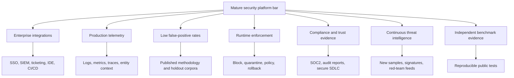
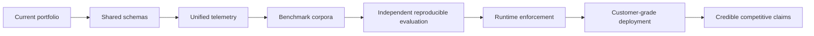

# Industry Research Benchmark and Product Victory Plan

Owner: Pooja Kiran (`poojakira`)
Date: 2026-07-21
Status: Research-backed benchmark plan, not a claim of current market superiority

## Non-Negotiable Honesty Statement

The current portfolio does not honestly beat all mature commercial/security platforms today. Mature platforms have years of production telemetry, enterprise integrations, compliance evidence, customer feedback loops, security research teams, and operational support. Claiming universal superiority now would be false.

The legitimate goal is narrower and stronger: define exact product benchmarks that would let each repository outperform a specific slice of the market, then build and verify against those benchmarks. This document is the bar that must be passed before making external claims.

## Research Sources and Evidence Quality

| Platform | Source | What the source says | Evidence quality |
|---|---|---|---|
| Snyk | [Snyk plans and capabilities](https://snyk.io/plans/) | SCA, SAST, IaC, container scanning, IDE/CLI/source-code integrations, visibility and prioritization. | Vendor source; reliable for feature inventory, not independent performance. |
| Wiz | [Wiz CNAPP overview](https://www.wiz.io/academy/cloud-security/what-is-a-cloud-native-application-protection-platform-cnapp) | Code-to-runtime CNAPP, graph-based risk, identities, vulnerabilities, data exposure, runtime activity, attack paths. | Vendor educational source; useful for market bar. |
| Datadog | [Datadog Cloud SIEM](https://www.datadoghq.com/product/cloud-siem/) and [Datadog Security docs](https://docs.datadoghq.com/security/) | Real-time detection, incident response, log/security correlation, 1000+ integrations, 800+ detection rules, SIEM and cloud security telemetry. | Vendor source; strong feature evidence, not performance benchmark. |
| Protect AI | [Protect AI platform](https://protectai.com/) | Guardian, Recon, and Layer on a unified AI security platform from model selection/testing to runtime monitoring. | Vendor source; feature inventory only. |
| Lakera | [Lakera prompt injection page](https://www.lakera.ai/risk/prompt-injection-attacks) | Vendor-claimed prompt-injection coverage across 100+ languages, 0.01% false-positive rate, <12ms average latency, audit/SIEM integrations. | Vendor claim; must not be repeated as independently verified. |
| Robust Intelligence | [AI Firewall](https://www.robustintelligence.com/platform/ai-firewall) and [Robust Intelligence docs](https://docs.robustintelligence.com/en/2.0-stable/documentation_home/robust_intelligence_intro.html) | Runtime AI firewall, AI validation, guardrails auto-configured to model vulnerabilities, dozens of preconfigured stress tests. | Vendor/docs source; useful target capability list. |
| Hugging Face Hub | [Hub security](https://huggingface.co/docs/hub/security) and [pickle scanning](https://huggingface.co/docs/hub/security-pickle) | MFA, SSO, malware scanning, secrets scanning, pickle import scanning using `pickletools.genops`, SOC2 Type 2. | Primary docs; strong baseline for model repository security. |
| NVIDIA garak | [garak GitHub](https://github.com/NVIDIA/garak), [garak site](https://garak.ai/), [CLI reference](https://reference.garak.ai/en/stable/cliref.html) | Open LLM vulnerability scanner with static, dynamic, adaptive probes, many model targets, probes/detectors/harnesses, CLI/reporting. | Primary/open-source evidence; good technical comparison point. |

## Market Bar Graph

## Honest Competitive Position Today

| Product | Current strongest differentiator | Current market gap | Can claim market leadership today? |
|---|---|---|---|
| mcp-security-gateway-monitor | Concrete MCP/tool-call and BCC bypass regression coverage | No 100+ language benchmark, no production latency/FP corpus, limited semantic/stateful detection | No |
| hf-model-provenance-scanner | Offline content-aware pickle/source scanning and renamed-file bypass tests | No Hub-scale integration, no malware engine, no trust portal, no registry policy engine | No |
| PulseNet-RUL-Forecasting | Secure ML serving reference with JWT, RBAC, tenant validation, audit chain | Not a general platform; local audit chain lacks WORM/SIEM anchoring | No |
| dataset-poisoning-detector | Streaming drift alarm and FP budget concepts | Clean-label and adaptive poisoning remain hard; no large real pipeline validation | No |
| llm-redteam-framework | Honest FP budget enforcement and leave-template-out methodology | Corpus too small vs garak/Lakera/RI-style scale; no live model probing by default | No |
| model-privacy-attacks | Correctness-tested MIA/extraction toolkit with probability fidelity | Synthetic validation; no enterprise privacy workflow | No |
| adversarial-ml-lab | Broad adversarial lab with signed benchmark verification | GPU/AutoAttack/RobustBench/physical-world gaps | No |
| unified-ml-security-platform | Honest architecture spec and self-contained stubs | Not a real unified platform | No |

## What It Would Mean To Beat Each Market Category

### 1. Beat Prompt-Injection Guardrails in a Narrow Segment

Target competitors: Lakera Guard, Robust Intelligence AI Firewall, garak probes for evaluation.

Honest win condition:

- Public multilingual benchmark with at least 100 languages or a clearly scoped subset.
- False-positive rate measured on benign production-like prompts, target <= 0.1% for blocking mode and <= 1% for review mode.
- p95 latency measured locally and in API mode, target <= 20ms for lightweight rules and <= 100ms with semantic fallback.
- Stateful multi-turn tests with session windows and tool-output injection.
- SIEM-compatible JSON events and replayable evidence artifacts.
- Evaluation against garak prompt-injection/encoding probes where legally and technically feasible.

Current products involved:

- `mcp-security-gateway-monitor`
- `llm-redteam-framework`
- `unified-ml-security-platform`

Build plan:

1. Create shared prompt-security schema: `PromptSecurityEvent`.
2. Add multilingual corpus ingestion and language labels.
3. Add semantic embedding fallback for uncertain regex/classifier outputs.
4. Add stateful session detector for multi-turn attacks.
5. Add garak adapter to run selected probes against local detectors.
6. Publish benchmark report with FP, FN, latency, language coverage, and confidence intervals.

Claim allowed only after proof:

> Outperforms simple regex and small TF-IDF guardrail demos on a published multilingual benchmark.

Claim not allowed without independent evidence:

> Better than Lakera, Robust Intelligence, or commercial guardrail platforms.

### 2. Beat Model Repository Scanning in a Developer-First Offline Segment

Target competitors: Hugging Face Hub scanning, Protect AI model security, general SCA/SAST tools.

Honest win condition:

- Detect pickle RCE by bytes and opcode, not extension.
- Detect malicious Python source gadgets, dynamic imports, subprocess, eval/exec, marshal/pickle loads.
- Verify actual file format headers for safetensors/GGUF/ONNX/Keras instead of trusting names.
- Produce signed scan evidence: file hash, finding hash, scanner version, timestamp.
- Generate CycloneDX SBOM and policy output.
- Run fully offline for local model repos.

Current product involved:

- `hf-model-provenance-scanner`

Build plan:

1. Add source import graph criticality: `__init__.py` and imported files are CRITICAL when dangerous sinks exist.
2. Add full safetensors/GGUF/ONNX/Keras structure validators.
3. Add signed JSON result artifacts with verifier CLI.
4. Add benchmark corpus containing safe/malicious model repos.
5. Compare against Hugging Face documented pickle-import scan behavior: import-list visibility is useful but not sufficient for local offline enforcement.

Claim allowed only after proof:

> Provides stricter offline local enforcement for renamed pickle and source gadget cases than extension-only scanners.

Claim not allowed:

> More comprehensive than Hugging Face Hub or Protect AI as an enterprise platform.

### 3. Beat Generic ML Demo Security

Target competitors: ordinary ML application demos, not mature AppSec platforms.

Honest win condition:

- Auth does not accept weak secrets.
- JWT algorithms are explicit.
- Tenant IDs cannot traverse paths.
- Audit records detect tampering, deletion, and reordering.
- Failed auth and critical security events are structured and queryable.
- Secrets are externally managed in production.

Current product involved:

- `PulseNet-RUL-Forecasting`

Build plan:

1. Add external audit anchoring: daily Merkle root or signed checkpoint.
2. Add structured failed-auth logs with source IP, user agent, tenant, reason.
3. Add RS256 deployment mode for multi-service deployments.
4. Add production threat-model appendix mapping STRIDE to implemented tests.

Claim allowed after proof:

> More security-complete than typical ML demo APIs.

Claim not allowed:

> Better than regulated enterprise ML serving platforms.

### 4. Beat Research-Only Poisoning Detectors in Operational Usefulness

Target competitors: simple anomaly scripts and academic-only demos.

Honest win condition:

- Supports batch and streaming detection.
- Enforces FP budget.
- Reports calibration and throughput context.
- Detects slow baseline drift.
- Integrates with REST/Kafka/Redis or equivalent production pipeline interface.
- Clearly labels clean-label detection limitations.

Current product involved:

- `dataset-poisoning-detector`

Build plan:

1. Add TracIn/influence approximation as optional module.
2. Add embedding-space isolation for suspected clean-label samples.
3. Add benchmark scripts for public poisoning datasets where licensing allows.
4. Add calibration curves and FP budget gating in CI.

Claim allowed after proof:

> More operationally honest than anomaly-only demos because it exposes FP budget, streaming drift, and deployment interfaces.

Claim not allowed:

> Solves clean-label poisoning.

### 5. Beat Small Prompt Classifier Demos

Target competitors: TF-IDF-only guardrail demos, not Lakera/gAttack/RI/garak-scale systems.

Honest win condition:

- Corpus >= 5000 prompts from documented sources.
- Categories balanced and reported.
- Leave-template-out and leave-source-out evaluation.
- FP budget blocks validation failure unless explicitly overridden.
- Semantic second-stage classifier reduces FP without hiding FN.
- Drift update mechanism for new jailbreak families.

Current product involved:

- `llm-redteam-framework`

Build plan:

1. Add external corpus ingestion with license metadata.
2. Add MinHash dedupe to prevent contamination.
3. Add sentence-transformer second-stage classifier for uncertain scores.
4. Add MLflow/DVC metrics tracking.
5. Add garak result import so generated probe failures become training/eval data.

Claim allowed after proof:

> Better methodology than small TF-IDF demos that hide false positives.

Claim not allowed:

> Better than garak, Lakera, or Robust Intelligence.

### 6. Beat Attack-Only Privacy Demo Repos

Target competitors: privacy attack examples that only run without quantitative correctness gates.

Honest win condition:

- Direct MIA, Shadow MIA, extraction, and Min-K% have effect-size assertions.
- Synthetic data is clearly marked as correctness-only.
- Real-model validation exists for at least one public model/dataset pair.
- Extraction reports probability fidelity, not only agreement.
- Ethics/responsible-use guardrails are explicit.

Current product involved:

- `model-privacy-attacks`

Build plan:

1. Add `VALIDATION.md` with one real-model run.
2. Add calibrated confidence intervals for AUC and TPR@FPR.
3. Add DP-SGD comparison baseline.
4. Add misuse warning and authorization checklist to CLI.

Claim allowed after proof:

> More rigorous than toy attack demos because it verifies effectiveness and fidelity metrics.

Claim not allowed:

> Comprehensive privacy auditing platform.

### 7. Beat Basic Adversarial ML Notebooks

Target competitors: FGSM/PGD-only notebooks and unsigned benchmark scripts.

Honest win condition:

- Attack implementation status is accurate.
- CPU tests cover core correctness.
- GPU tests cover strong attacks on schedule.
- AutoAttack and RobustBench comparisons exist where claimed.
- Benchmark outputs are signed and independently verifiable.
- Digital vs physical-world attack scope is clearly labeled.

Current product involved:

- `adversarial-ml-lab`

Build plan:

1. Add self-hosted GPU workflow or documented manual GPU benchmark protocol.
2. Add AutoAttack integration or keep it stubbed.
3. Add RobustBench comparison report for a small supported model.
4. Add CI post-benchmark verification using `benchmark_verify.py`.
5. Split physical digital simulation from true physical-world validation.

Claim allowed after proof:

> More credible than basic adversarial notebooks due to breadth, status integrity, and signed artifacts.

Claim not allowed:

> Better than RobustBench or AutoAttack reference benchmarking.

### 8. Beat Empty Platform Scaffolds

Target competitors: portfolio repos that claim platforms but contain non-runnable scaffolds.

Honest win condition:

- Spec repo clearly states it is a spec until real integration exists.
- Compose config is self-contained.
- Stub services honestly return `implementation_not_bundled` for unsupported operations.
- CI pins actions and signs pushed images.
- Future real integration has health checks and version-pinned service contracts.

Current product involved:

- `unified-ml-security-platform`

Build plan:

1. Build thin real integration for repos 1, 2, 3, and 4.
2. Add shared schema and auth contract.
3. Add nginx/FastAPI gateway routing.
4. Add integration tests that prove health and one request path per service.
5. Replace stubs with version-pinned containers only when each service is real.

Claim allowed now:

> More honest than scaffolds that falsely present themselves as working platforms.

Claim not allowed now:

> Working unified ML security platform.

## Cross-Product Strategy To Become Legitimately Competitive

## Required Shared Capabilities

| Capability | Why it matters | Required implementation |
|---|---|---|
| Shared event schema | Mature platforms correlate across signals | `mlsec_event.schema.json` with repo, asset, finding, severity, evidence, hash |
| Signed evidence | Mature platforms support auditability | HMAC or Sigstore signed scan/eval artifacts |
| Telemetry | SOC teams need incident signals | JSON logs, Prometheus metrics, health endpoints, trace IDs |
| FP/FN benchmarks | Detection quality needs measurement | Public benchmark corpus with benign/adversarial splits |
| Versioned APIs | Integration needs stable contracts | OpenAPI specs for scanner/detector/evaluator services |
| CI gates | Claims must fail when evidence fails | coverage, lint, typecheck, security, benchmark thresholds |
| Trust docs | Enterprise reviewers ask for controls | threat model, security policy, limitations, validation docs |

## The Honest Claim Ladder

Use this ladder. Do not skip levels.

1. Level 1: Toy demo
   - Runs locally, happy path only.
   - Do not market as secure.

2. Level 2: Research-grade
   - Has tests and known limitations.
   - Can compare to academic baselines.

3. Level 3: Security-engineering portfolio
   - Has adversarial tests, CI, threat model, signed artifacts, FP budgets.
   - This is the current target for most repos.

4. Level 4: Product candidate
   - Has APIs, telemetry, deployment docs, stable schemas, public benchmarks.
   - Some repos are approaching this but not all.

5. Level 5: Commercially competitive
   - Has real users, scale data, compliance evidence, support model, independent benchmarks.
   - The portfolio is not here yet.

6. Level 6: Beats mature platforms
   - Outperforms named platforms on independent, reproducible, scoped benchmarks.
   - No repo can honestly claim this today.

## Product-by-Product Victory Metrics

| Product | Metric to beat | Minimum credible target |
|---|---|---|
| mcp-monitor | Prompt injection FP/FN and latency | >= 95% recall on public bypass corpus, <= 1% FP review mode, <= 100ms p95 with semantic fallback |
| hf-scanner | Malicious model repo detection | Detect renamed pickle, source gadgets, invalid headers, and signed evidence for every finding |
| PulseNet | Secure ML API controls | Auth/RBAC/audit/security tests pass, audit chain externally anchored, secrets externally managed |
| poisoning-detector | Drift/poison detection utility | FP <= operator budget, slow drift alarm, clean-label suspect mode, throughput benchmark |
| llm-redteam | Corpus/eval rigor | >= 5000 prompts, leave-source-out evaluation, FP budget gate, semantic fallback |
| privacy-attacks | Attack correctness and validation | AUC > random with CI, TPR@1%FPR reported, one real-model validation |
| adversarial-lab | Benchmark credibility | CPU core tests, GPU strong-attack tests, signed artifacts, AutoAttack/RobustBench where claimed |
| unified-platform | Integration honesty | Real health checks, shared schema, version-pinned services, no unsupported production claim |

## What To Build Next, In Order

P0: claim safety and evidence

1. Add `docs/INDUSTRY_RESEARCH_BENCHMARK.md` and keep it linked.
2. Add shared security event schema to Repo 8.
3. Add telemetry requirements to every repo README.
4. Add signed artifact verifier pattern from adversarial-lab to hf-scanner and redteam reports.

P1: product capability

5. Add OpenAPI wrappers for hf-scanner, mcp-monitor, poisoning-detector, and llm-redteam.
6. Add benchmark corpus folders with license metadata.
7. Add FP/FN/latency benchmark commands.
8. Add CI gates that fail when benchmarks regress.

P2: industry comparison

9. Run garak probes against llm-redteam/mcp-monitor adapters.
10. Compare hf-scanner against a local corpus inspired by Hugging Face pickle scanning docs.
11. Compare adversarial-lab against AutoAttack/RobustBench on one small model.
12. Publish result tables with failures included.

P3: actual platform

13. Replace Repo 8 stubs with real service containers.
14. Add shared auth and schema.
15. Add Prometheus/Grafana stack.
16. Add signed evidence store.

## Claim Policy

Allowed now:

- "The portfolio is more rigorous than typical toy demos because it includes adversarial tests, security regressions, FP budgets, signed benchmark verification, and honest limitations."
- "Several repos are product-candidate components, not a finished unified platform."
- "The platform repo is an architecture spec with self-contained stubs."

Not allowed now:

- "Beats all mature commercial platforms."
- "Production-grade unified platform."
- "Unhackable."
- "Better than Lakera/Snyk/Wiz/Datadog/Protect AI/Robust Intelligence/Hugging Face/garak" without an independent scoped benchmark.

Allowed later only with evidence:

- "Outperforms [named baseline] on [named benchmark] under [version/date/config] with [metric]."

## Final Sceptical Assessment

The right path is not to claim superiority. The right path is to make the portfolio impossible to dismiss: every product has a threat model, benchmark, regression tests, telemetry, signed evidence, and clear limits. Once those are in place, specific scoped wins over mature tools may become legitimate. Until then, the honest competitive statement is that this portfolio is unusually rigorous for a public ML security portfolio, but not yet a mature commercial platform competitor.